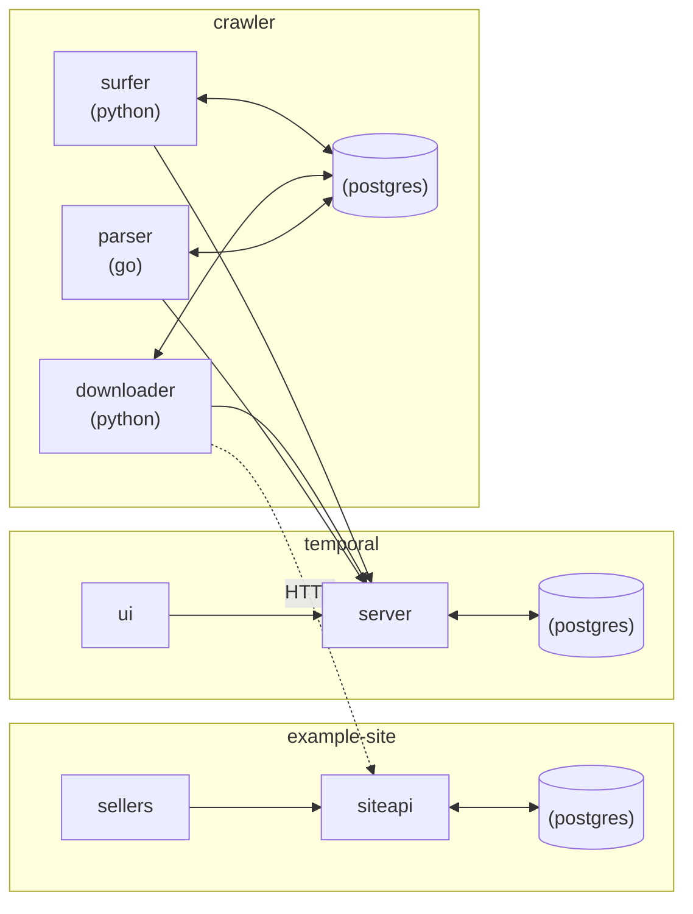
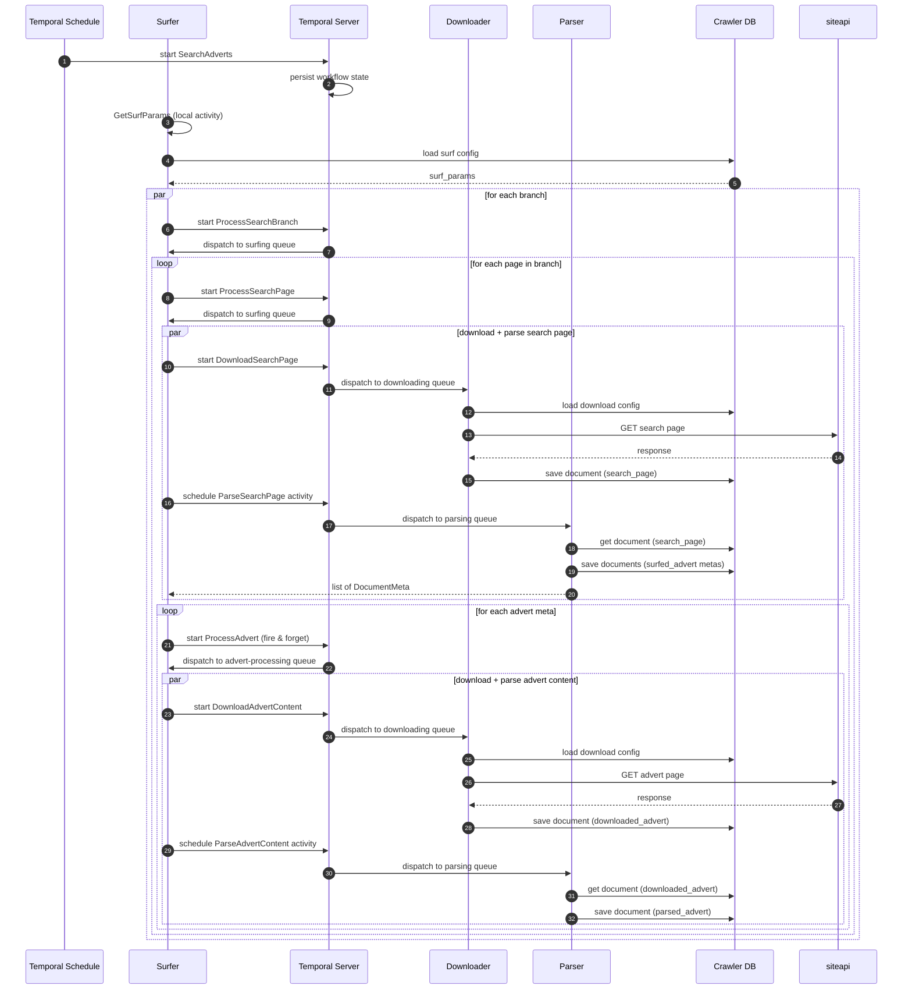

Crawler, Python code:
[](https://github.com/vitalyshatskikh/crawler-temporal-demo/actions/workflows/ci-crawler-py.yml)
[](https://codecov.io/gh/vitalyshatskikh/crawler-temporal-demo)

Crawler, Go code:
[](https://github.com/vitalyshatskikh/crawler-temporal-demo/actions/workflows/ci-crawler-go.yml)
[](https://codecov.io/gh/vitalyshatskikh/crawler-temporal-demo)

Example site:
[](https://github.com/vitalyshatskikh/crawler-temporal-demo/actions/workflows/ci-example-site.yml)
[](https://codecov.io/gh/vitalyshatskikh/crawler-temporal-demo)

---

# Crawler

Distributed web crawling/scraping app built on Temporal for workflow orchestration.
Python surfer and downloader components, Go parser component, and a Go example
classifieds site that acts as the scrape target.

## Architecture



## SearchAdverts workflow



## Prerequisites

- docker
- docker compose

## Run

```bash
make infra
make example-site
make crawler
```

`make infra` starts the Temporal stack — server, postgres, opensearch, UI on
http://localhost:8080 (namespace `crawler` is created automatically).

`make example-site` starts the target site — `siteapi` on http://localhost:8090
with Swagger UI at `/docs`, plus three sellers continuously creating and
deleting adverts.

`make crawler` starts the crawler workers (surfer, downloader, parser) — no
exposed HTTP ports, just Temporal workers polling their queues.

Open http://localhost:8080 to watch `SearchAdverts` and child workflows run.

## Stop

```bash
make crawler-down
make example-site-down
make infra-down
```

## Develop

### Prerequisites

- docker, docker compose
- python
- go

```bash
make setup-dev
make infra
make example-site
(cd crawler && docker-compose up -d postgres migrate)
```

## Links

- [samples-server/compose](https://github.com/temporalio/samples-server/tree/main/compose) - Run Temporal services using docker-compose
